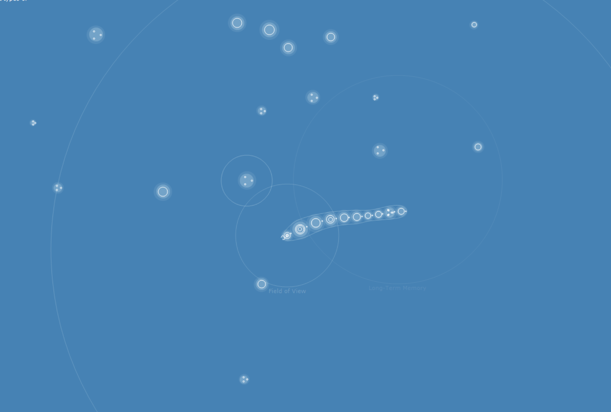

# CellSim

A cellular life simulation written in C#.NET.

The cells demonstrate simple AI behaviour. The beings need all of the different types of
essence to survive.

- Full (non-rotational) world movement implemented.
- Left-click to select, right-click to drag.
- Hold ctrl while left-clicking to lock camera onto target.
- To change the time scale, hold down 'T' and scroll
  with the mouse wheel.
- You can 'jump to being' by clicking on its corresponding
  waypoint in the radar (to the right).
- Hold shift while scrolling with the mouse wheel to
  scroll this text.

## Installation

- This project requires [DirectX SDK](http://microsoft.com/download/details.aspx?id=6812).

Tested on Visual Studio 2019 Community.

## Attribution

**Music:**

"I Dream" by [nomadicxxl](https://freesound.org/s/371802/). Licence: [CC BY 3.0](https://creativecommons.org/licenses/by/3.0/).

**Effects:**

"Ting" by [Popup Pixels](http://soundbible.com/1628-Ting.html). Licence [CC BY 3.0](https://creativecommons.org/licenses/by/3.0/).

## Notes

- This was a project written for a hobby a while back which I stumbled upon in archives.
- Original codename: "AI".
